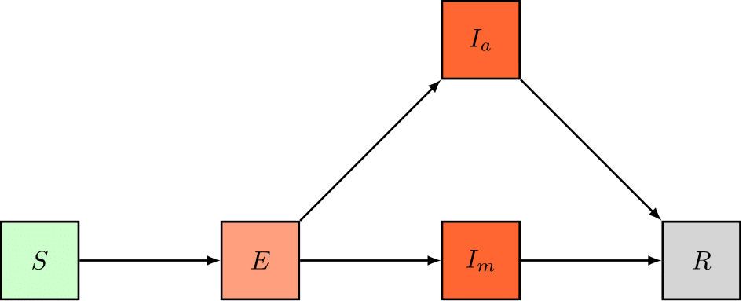

# An SDE Model for the 2017-2018 Influenza Season in Belgium

In this tutorial, we'll set up a stochastic age-stratified model for seasonal Influenza in Belgium. First, we'll expand the dynamics of the [simple SIR model](workflow.md) to account for additional charateristics of seasonal Influenza and we'll use the concept of *dimensions* to include four age groups in our model. Opposed to the simple SIR tutorial, where changes in the number of social contacts were not considered, we'll use a *time-dependent parameter function* to include the effects of school closures during school holidays in our Influenza model. Finally, we'll calibrate two of the model's parameters to incrementally larger sets of incidence data and asses how the goodness-of-fit evolves with the amount of knowledge at our disposal. One of the calibrated model parameters is a 1D vector, pySODM allows users to easily calibrate n-dimensional model parameters.

This tutorial introduces the following concepts,
- Building a stochastic model and solving it with Gillespie's Tau-Leaping method
- Stratifying an epidemiological model to include age groups
- Calibrating n-D parameters to n-D datasets

This tutorial can be replicated using `~/tutorials/influenza_1718/calibration.py`

## Data

Data on the weekly incidence of visits to General Practictioners (GP) are made publically available by the Belgian Scientific Institute of Public Health (Sciensano). These data were retrieved from the "End of season" report on Influenza in Belgium (see `data/raw/Influenza 2017-2018 End of Season_NL.pdf`). Using [Webplotdigitizer](https://automeris.io/WebPlotDigitizer/), the weekly number of GP visits in the different age groups were extracted (see `data/raw/dataset_influenza_1718.csv`). Then, the script `data_conversion.py` was used to convert the *raw* weekly incidence of Influenza cases in Belgium (per 100K inhabitats) during the 2017-2018 Influenza season into a better suited format. The weekly incidence was first converted to the absolute GP visits count by multipying with the demographics. Then, it was assumed that the weekly incidence was the sum of seven equal counts throughout the week preceding the data collection, and hence the weekly data were divided by seven. The formatted data are located in `data/interim/data_influenza_1718_format.csv`.


The data are loaded in our calibration script `~/tutorials/influenza_1718/calibration.py` as a `pd.DataFrame` with a `pd.Multiindex`. The `time`/`date` axis is obligatory. The other index names and values are the same as the model's dimensions and coordinates. In this way, pySODM recognizes how model prediction and dataset must be aligned.

```bash
date        age_group
2017-11-27  (0, 5]        15.373303
            (5, 15]       13.462340
            (15, 65]     409.713333
            (65, 120]     33.502705
                            ...    
2018-05-07  (0, 5]         0.000000
            (5, 15]        0.000000
            (15, 65]       0.000000
            (65, 120]      0.000000
Name: CASES, Length: 96, dtype: float64
```

> **NOTE** If we'd stratify our model further to include spatial patches, we could still calibrate the model to the DataFrame above. pySODM would, by default, sum over the model's spatial axis to align the prediction with the data. This automatic summation can be replaced with a user-defined function, see input argument `aggregation_function` of `log_posterior_distribution`.

## Model dynamics, equations and parameters

We'll extend the SIR model by making two changes. First, we'll add an *exposed* state (E), to account for the latent phase between the moment of infection and the onset of infectiousness. Second, we'll split the *infectious* state (I) in two to account that not all infectious individuals visit a GP and remain undetected. We'll include a state for individuals who are infectious but remain undetected (Ia), either because these individuals have no symptoms, or these individuals don't visit the general practicioner (GP), and, we'll include a state for individuals who are infectious and go to the GP (Im).



We'll simulate these dynamics stochastically with Gillespie's Tau-Leaping method. Instead of defining a differential equation for every model state, we need to define the rates of all possible transitionings in the system,
```{math}
\begin{cases}
T^i &=& S^i + E^i + I_a^i + I_m^i + R^i,\\
\mathcal{R}(S \rightarrow E_i)^i &=& \beta \sum_j N^{ij} \dfrac{(I_a^j + I_m^j)}{T^j},\\
\mathcal{R}(E \rightarrow I_a)^i &=& \dfrac{f_a^i}{\sigma}, \\
\mathcal{R}(E \rightarrow I_m)^i &=& \dfrac{1-f_a^i}{\sigma}, \\
\mathcal{R}(I_a \rightarrow R)^i &=& \dfrac{1}{\gamma}, \\
\mathcal{R}(I_m \rightarrow R)^i &=& \dfrac{1}{\gamma}, 
\end{cases}
```
here, the subscript {math}`i` refers to the model's age groups: {math}`[0,5(, [5,15(, [15,65(,\text{ and } [65,120(` years old. {math}`S` denotes the number of individuals suceptible to the disease, {math}`E` denotes the number of exposed individuals, {math}`I_a` denotes the number of infectious but undetected individuals and {math}`I_m` denotes the number of infectious individuals who visit the GP and {math}`R` denotes the number of removed individuals, either through death or recovery. The model has five parameters,
- {math}`\beta` : Per-contact chance of Influenza transmission. Calibrated.
- {math}`N^{ij}` : Square origin-destination matrix containing the number of social contacts in age group {math}`i` with individuals from age group {math}`j`. Extracted from [Socrates](http://www.socialcontactdata.org/socrates/). Dataset: Hoang, Belgium, 2010. Physical contacts with a duration of 15+ minutes only.
- {math}`f_a^i` : Age-stratified fraction of undetected cases. Calibrated.
- {math}`\sigma` : Length of the latent phase, assumed equal to two days.
- {math}`\gamma` : Length of infectiousness, assumed equal to five days.

Assuming these rates are exponentially distributed, the probability of a single transition from a generic state A to B in age class {math}`i` happening between time {math}`t` and {math}`t+\tau`, is,
```{math}
\mathcal{P}(A \rightarrow B)^i = 1 - e^{- \tau*\mathcal{R}(A \rightarrow B)^i}.
```
The corresponding number of transitions {math}`A \rightarrow B` in age class {math}`i` and between time {math}`t` and {math}`t + \tau` are then generated by drawing from a binomial distribution,
```{math}
\mathcal{N}(A \rightarrow B)^i = Binom(\mathcal{P}(A \rightarrow B)^i, A^i).
```
The number of individuals in each of the compartments at time {math}`t + \tau` is then given by,
```{math}
\begin{cases}
S^i(t+\tau) &=& S^i(t) - \mathcal{N}(S \rightarrow E)^i,\\
E^i(t+\tau) &=& E^i(t) + \mathcal{N}(S \rightarrow E)^i - \mathcal{N}(E \rightarrow I_a)^i - \mathcal{N}(E \rightarrow I_m)^i,\\
I_a^i(t+\tau) &=& I_a^i(t) + \mathcal{N}(E \rightarrow I_a)^i - \mathcal{N}(I_a \rightarrow R)^i, \\
I_m^i(t+\tau) &=& I_m^i(t) + \mathcal{N}(E \rightarrow I_m)^i - \mathcal{N}(I_m \rightarrow R)^i, \\
R^i(t+\tau) &=& R^i(t) + \mathcal{N}(I_a \rightarrow R)^i + \mathcal{N}(I_a \rightarrow R)^i,
\end{cases}
```

## Coding it up

### The model

Opposed to ODE models, where the user had to define an `integrate()` function to compute the values of the derivatives at time {math}`t`, the user will have to define [two functions](models.md) to setup an SDE model: 1) A function to compute the rates at time {math}`t` named `compute_rates()`, and 2) A function to compute the values of the model states at time {math}`t+\tau` named `apply_transitionings()`. As we did in the [packed-bed continuous flow reactor](enzyme_kinetics.md) tutorial, we'll stratifiy the model into age groups by specifying a variable `dimension_names` in our model declaration and we'll implement the parameter {math}`f_a` as a stratified parameter by specifying a variable `parameter_stratified_names`. **As dimension name, we use the same name as the age dimension in the dataset: `'age_group'`. The coordinates of the dimension will be defined later when the model is initialized, we'll have to use the same coordinates as the dataset.** As in the [enzyme kinetics tutorial](enzyme_kinetics.md), we'll group our model in a file called `models.py` to reduce the complexity of our calibration script. We introduce one additional state in the model, the incidence of new detected cases, `I_m_inc`, which we'll use this state to match our data to.

```python
from pySODM.models.base import SDEModel

class SDE_influenza_model(SDEModel):

    """
    Simple stochastic SEIR model for influenza with undetected carriers
    """
    
    state_names = ['S','E','Ia','Im','R','Im_inc']
    parameter_names = ['beta','sigma','gamma','N']
    parameter_stratified_names = ['f_a']
    dimension_names = ['age_group']

    @staticmethod
    def compute_rates(t, S, E, Ia, Im, R, Im_inc, beta, sigma, gamma, N, f_a):

        # Calculate total population
        T = S+E+Ia+Im+R

        # Compute rates per model state
        rates = {
            'S': [beta*np.matmul(N, (Ia+Im)/T),],
            'E': [f_a*(1/sigma), (1-f_a)*(1/sigma)],
            'Ia': [(1/gamma)*np.ones(T.shape),],
            'Im': [(1/gamma)*np.ones(T.shape),],
        }

        return rates

    @staticmethod
    def apply_transitionings(t, tau, transitionings, S, E, Ia, Im, R, Im_inc, beta, sigma, gamma, N, f_a):

        S_new  = S - transitionings['S'][0]
        E_new = E + transitionings['S'][0] - transitionings['E'][0] - transitionings['E'][1]
        Ia_new = Ia + transitionings['E'][0] - transitionings['Ia'][0]
        Im_new = Im + transitionings['E'][1] - transitionings['Im'][0]
        R_new = R + transitionings['Ia'][0] + transitionings['Im'][0]
        Im_inc_new = transitionings['E'][1]

        return S_new, E_new, Ia_new, Im_new, R_new, Im_inc_new
```

There are some formatting requirements to `compute_rates()` and `apply_transitionings()`, which are listed in the [SDEModel documentation](models.md).

The actual drawing of the transitionings is abstracted away from the user in the `SDEModel` class. Two stochastic simulation algorithms are currently available. In this tutorial, we'll use the Tau-Leaping method, where the value of `tau` is fixed and the number of transitionings in the interval `t` and `t + \tau` are drawn from a binomial distribution. This method is an approximation of the Stochastic Simulation Algorithm (SSA), where the time until the first transitioning `tau` is computed and only one transitioning can happen at every simulation step. However, as we aim to simulate a large number of individuals (11 million individuals), the time between transitionings becomes very small and the SSA becomes computationally too demanding. Good values for `tau` are typically found by balancing the use of computational resources against numerical stability. 

### Social contact function

The number of work and school contacts tends to change during school holidays and this has an effect on Influenza spread. We'll thus use a *time-dependent parameter function* to vary the number of social contacts {math}`\mathbf{N}` during the simulation. We'll wrap our `contact_function()` in a class for the sake of user friendliness. The initialization of the class is used to store the contact matrix during holidays and non-holidays. The callable function `__call__` is used to return the right contact matrix. Notice the decorator `@lru_cache()`, which loads the contact matrices in working memory so these have to be read only once during the simulation. The `contact_function()` is the actual pySODM-compatible *time-dependent parameter function*, which implements the social policies. We'll add our TDPF to the `models.py` script.

```python
class make_contact_matrix_function():

    # Initialize class with contact matrices
    def __init__(self, N, N_holiday):
        self.N = N
        self.N_holiday = N_holiday

    # Define a call function to return the right contact matrix
    @lru_cache()
    def __call__(self, t, holiday=False):
        if not holiday:
            return self.N
        else:
            return self.N_holiday

    # Define a pySODM compatible wrapper with the social policies
    def contact_function(self, t, states, param, ramp_time):

        delay = pd.Timedelta(days=ramp_time)

        if t <= pd.Timestamp('2017-12-20')+delay:
            return self.__call__(t)
        # Christmass holiday
        elif pd.Timestamp('2017-12-20')+delay < t <= pd.Timestamp('2018-01-05')+delay:
            return self.__call__(t, holiday=True).copy()
        # Christmass holiday --> Winter holiday
        elif pd.Timestamp('2018-01-05')+delay < t <= pd.Timestamp('2018-02-10')+delay:
            return self.__call__(t)
        # Winter holiday
        elif pd.Timestamp('2018-02-10')+delay < t <= pd.Timestamp('2018-02-18')+delay:
            return self.__call__(t, holiday=True)
        # Winter holiday --> Easter holiday
        elif pd.Timestamp('2018-02-18')+delay < t <= pd.Timestamp('2018-03-28')+delay:
            return self.__call__(t)
        # Easter holiday
        elif pd.Timestamp('2018-03-28')+delay < t <= pd.Timestamp('2018-04-16')+delay:
            return self.__call__(t, holiday=True)
        else:
            return self.__call__(t)
```

### Initializing the model

Next, we'll set the model up in our calibration script `~/tutorials/influenza_1718/calibration.py`. We load the model and social contact function from `models.py` and initialize the contact matrix function using the social contact matrices (hardcoded in the example). Then, as always, we define the model parameters, initial states (obtained analytically so the differentials are zero at {math}`t=0`) and coordinates. **The coordinates for dimension `age_groups` must be the same as the dataset: `pd.IntervalIndex.from_tuples([(0,5),(5,15),(15,65),(65,120)]`**. 

```python

# Load model
from models import SDE_influenza_model as influenza_model

# Load TDPF
from models import make_contact_matrix_function

# Hardcode the contact matrices
N_noholiday = ...
N_holiday = ...

# Initialize contact function
contact_function = make_contact_matrix_function(Nc_work, Nc_school, Nc_except_workschool).contact_function

# Define model parameters
params={'beta': 0.034, 'sigma': 1, 'f_a': np.array([0.01, 0.63, 0.88, 0.76]), 'gamma': 5, 'N': N_except_workschool+N_school+N_work}

# Define initial condition
init_states = {'S': list(initN.values),
               'E': list((1/(1-params['f_a']))*df_influenza.loc[start_calibration, slice(None)]),
               'Ia': list((params['f_a']/(1-params['f_a']))*params['gamma']*df_influenza.loc[start_calibration, slice(None)]),
               'Im': list(params['gamma']*df_influenza.loc[start_calibration, slice(None)]),
               'Im_inc': list(df_influenza.loc[start_calibration, slice(None)])}

# Define model coordinates
coordinates={'age_group': pd.IntervalIndex.from_tuples([(0,5),(5,15),(15,65),(65,120)])}

# Initialize model
model = influenza_model(init_states,params,coordinates,time_dependent_parameters={'N': contact_function})
```

### Calibration

We aim to calibrate two model parameters: {math}`\beta` and {math}`\mathbf{f_a}`. However, {math}`\mathbf{f_a}` consists of four elements {math}`f_a^i`, how does pySODM handle this?

As if nothing's up,

```python

if __name__ == '__main__':

    from pySODM.optimization.objective_functions import log_posterior_probability, ll_negative_binomial

    # Define dataset
    data=[df_influenza[start_date:end_calibration], ]
    states = ["Im_inc",]
    log_likelihood_fnc = [ll_negative_binomial,]
    log_likelihood_fnc_args = [5*[0.03,],]

    # Calibated parameters and bounds
    pars = ['beta', 'f_a']
    labels = ['$\\beta$', '$f_a$']
    bounds = [(1e-6,0.06), (0,0.99)]

    # Setup objective function (no priors --> uniform priors based on bounds)
    objective_function = log_posterior_probability(model, pars, bounds, data, states, log_likelihood_fnc, log_likelihood_fnc_args, labels=labels)
```

In the example above, bounds and labels of {math}`\mathbf{f_a}` are automatically expanded to the right size when the log posterior probability function is initialized. However, I have retained the possibility of supplying a bound and label per element of {math}`\mathbf{f_a}`. Running the NM/PSO and MCMC optimizations happens in the same manner as the other tutorials.

## Results and discussion

We're now ready to generate our results, we'll first calibrate the model using data up until December 15th, 2017, thus, only two datapoints are available. Then, we'll calibrate the model to data until January 1st, 2018, well before the peak incidence around mid February, 2018. The, we'll increase the amount of available data until February 1st, 2018 and then March 1st, 2018, representing the moment right before, and right after, the peak incidence. Let's first have a look at the sampled distributions of {math}`\beta` and {math}`\mathbf{f_a}` on the largest dataset (ending March 1st, 2018).

The optimal values of the fraction of undetected cases {math}`\mathbf{f_a}` are: `f_a = [0.01, 0.66, 0.89, 0.70]`. The undetected fraction is thus very small in children aged five years and below, then increases to 89% in individuals aged 15 to 65 years old, and finally decreases to 70% in the senior population. Some (mild) degree of correlation between the infectivity {math}`\beta` and the fraction of undetected cases {math}`\mathbf{f_a}` is visible. This could be expected, a higher infectivity would logically result in a lower fraction of detected cases to obtain the same fit to the data.


Next, we show, for every age group and for our three calibration datasets, the model trajectories plotted on top of the data. Considering how rudimentary this model is, even the predictions made on January 1st, 2018, one month and a half before the peak incidence, are reasonably accurate and can be informative to policymakers and economists. It should be noted that the peak incidence in all age groups falls at least two weeks earlier than was the case in real life, and this is most apparent in the age group {math}`[15,65(`.

As previously mentioned, this is a rudimentary model and I see two ways of improving its predictive accuracy. First, the model subdivides the population in only four groups depending on their age, this inherently assumes an individual of an age class {math}`i` is equally likely to have contact with any other individual in age group {math}`i`, even if this person lives on the other side of the country. The model accuracy could be improved significantly by including spatial patches (and potentially human mobility) in the model. As the peak incidence during an epidemic is the superposition of the peaks in different areas, adding spatial heterogeneity will likely broaden and postpone the peak incidence. Additionally, including the protective effects of vaccination could likely further improve this model's accuracy by lowering the peak incidence in the elderly population, which is more likely to get vaccinated.

**Calibration ending on December 15th, 2018**


**Calibration ending on January 1st, 2018**


**Calibration ending on February 1st, 2018**

