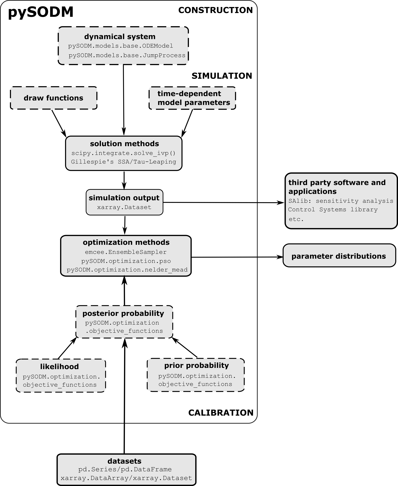

## pySODM

*Simulating and Optimising Dynamical Models in Python 3*

Resources: [documentation](https://twallema.github.io/pySODM), [peer-reviewed paper](https://www.sciencedirect.com/science/article/pii/S1877750323002089), [pyPI](https://pypi.org/project/pySODM/)

 

### Quick installation

```
pip install pySODM
```

### Aim & scope

All the simulation projects I've undertaken over the past six years required me to do most of the following,
1. Translate a real-world transient phenomenon into a set of differential equations called a "model" and integrate it starting from an initial condition.
2. The model's states may be represented by n-dimensional arrays, labeled using coordinates.
3. The model's parameters may have time-dependencies. 
4. The model's parameters may have to be sampled from distributions.
5. The model's initial condition may have to be sampled from a distribution.
5. The model's parameters may have to be calibrated to a dataset(s) by defining and optimising a cost function

all these features required me to wrap bookkeeping code around an ODE solver, typically `scipy.solve_ivp`, and I got tired of recycling the same code over and over again, so I packaged it into pySODM.

Other simulation software exists in Python, but I found most will hold your hand by having you define symbolic transitions, which places a limit on the attainable complexity of a model, making it unfit for academic research. I wanted a piece a software that nicely does all the nasty bookkeeping like keeping track of state sizes, time dependencies on parameters, aligning simulations with datasets etc. and does so in the most **generically applicable** way possible. 

### Software structure

To achieve its goal, pySODM bundles a set of low-level interfaces to integrate sets of ODEs (scipy.integrate), simulate stochastic jump processes (Gillespie methods), store n-dimensional temporal data (`xarray.Dataset`), perform frequentist optimizations of model parameters using Particle Swarm Optimization or the Nelder–Mead Simplex algorithm, and, perform Bayesian inference of model parameters (emcee.EnsembleSampler), all of which were already available in Python 3. pySODM adds a generic way to implement time-dependencies on model parameters, perform consecutive simulations with parameter sampling and/or initial condition sampling.  



**Figure** Solid boxes depict third-party implementations incorporated in pySODM, while the dashed boxes depict implementations provided by pySODM.

### Features

| Workflow                     | Features                                                                                                                        |
|------------------------------|---------------------------------------------------------------------------------------------------------------------------------|
| Construct a dynamical model     | Implement systems of coupled differential equations            |
|                                 | Labeled n-dimensional model states, states can have different sizes                                     |
|                                 | Leverages `xarray.Dataset` to store labeled n-dimensional simulation output |
| Simulating the model            | Deterministic (ODE) or stochastic simulation (Jump process) |
|                                 | *Time-dependent parameter functions* to vary parameters during the course of a simulation |
|                                 | *Draw functions* to vary model parameters during consecutive simulations |
|                                 | *Initial condition functions* to vary the initial condition during consecutive simulations |
| Calibrate the model             | Construct and maximize a posterior probability function  |
|                                 | Automatically aligns data and simulation  |
|                                 | Nelder-Mead Simplex and Particle Swarm Optimization |
|                                 | Bayesian inference with `emcee.EnsembleSampler`                  |

### Getting started

- Detailed [installation instructions](installation.md).

- The [quistart tutorial](quickstart.md) teaches the basics of building and simulating models with n-dimensional labeled states in pySODM. It demonstrates the use of *time-dependent parameter functions* (TDPFs) to vary model parameters over the course of a simulation and *draw functions* to vary model parameters during consecutive simulations.

- The [workflow](worfklow.md) tutorial provides a step-by-step introduction to building a mathematical model and calibrating its parameters to a dataset. An SIR disease model is built and the basic reproduction number during an outbreak is determined by calibrating the model to the outbreak data. 

- The [enzyme kinetics](enzyme_kinetics.md) and [influenza 17-18](influenza_1718.md) case studies apply the [workflow](workflow.md) to more advanced, real-world problems. In the enzyme kinetics case study, a 1D packed-bed reactor model is implemented in pySODM by reducing the PDEs to a set of coupled ODEs by using the method-of-lines. In the Influenza 17-18 case study, a stochastic, age-structured model for influenza is developped and calibrated to the Influenza incidence data reported by the Belgian Federal Institute of Public Health. These case studies mainly serve to demonstrate pySODM's capabilities across scientific disciplines and highlight the arbitrarily complex nature of the models that can be built with pySODM. For an academic exposee of pySODM, the Enzyme Kinetics and Influenza 17-18 case studies, checkout our [peer-reviewed paper](https://www.sciencedirect.com/science/article/pii/S1877750323002089).
