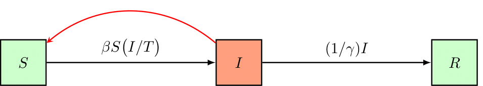

## Quickstart

In this quickstart tutorial, we'll set up a simple (ODE) SIR disease model and calibrate its basic reproduction number to a synthetically generated dataset. We'll then asses what happens if the pathogen's infectivity is lowered. We'll use a simple model but cover the most important concepts and features of `pySODM`, you'll learn about building more complex models in other tutorials (REF). This quickstart tutorial serves as a template for a typical workflow:
1. Import dependencies
2. Load the dataset
3. Load/Define a model
4. Initialize the model
5. Perform a frequentist optimization
6. Perform a bayesian optimization
7. Visualize the result

The quickstart example can be reproduced using `~/tutorials/quickstart/quickstart.py`

### Import dependencies

I typically place all my dependencies together at the top of my script. However, for this demo, we'll import some common dependencies here and then import the pySODM code on the go. That way, the imports of the necessary pySODM code are located where they are required which is more illustrative than including them all here.

```
import numpy as np
import pandas as pd
from matplotlib.pyplot import plt
```

### Generating synthetic data

First, we'll generate a sythetic dataset of disease cases. We'll accomplish this by assuming the disease is generating cases exponentially with a doubling time of 10 days. Mathematically,

```{math}
n_{cases} = e^{t * \frac{log(2)}{t_d}}
```

We'll assume the first case was detected on December 1st, 2022 and data was collected on every weekday until December 21st, 2022. Then, we'll add observational noise to the synthetic data. For count based data, observational noise is typically the result of a poisson or negative binomial proces, depending on the occurence of overdispersion. For a poisson proces, the variance is equal to the mean: {math}`\sigma^2 = \mu`, while for a negative binomial proces the mean-variance relationship is quadratic: {math}`\sigma^2 = \mu + \alpha \mu^2`. For this example we'll assume the data are overdispersed so we'll resample the data using the negative binomial distribution. A dispersion factor `alpha=0.03` is used, which was representative for data collection during the COVID-19 pandemic in Belgium.

```
# Parameters
alpha = 0.03 # Overdispersion
t_d = 10 # Doubling time
# Sample data
dates = pd.date_range('2022-12-01','2023-01-21')
t = np.linspace(start=0, stop=len(dates)-1, num=len(dates))
y = np.random.negative_binomial(1/alpha, (1/alpha)/(np.exp(t*np.log(2)/td) + (1/alpha)))
# Place in a pd.Series
d = pd.Series(index=dates, data=y, name='CASES')
# Data collection only on weekdays only
d = d[d.index.dayofweek < 5]
```

Datasets used in an optimization must always be pandas Series or DataFrames. In the dataset, an index level named `time` (if the time axis consists of int/float) or `date` (if the time axis consists of dates) must always be present. In this tutorial, we'll use dates and thus name the index of our dataset `date`.  

```
# Index name must be data for calibration to work
d.index.name = 'date'
```


### Defining and initializing the model

In this demo we'll set up an SIR disease model governed by the following set of equations,

```{math}
\begin{eqnarray}
N &=& S + I + R, \\
\frac{dS}{dt} &=& - \beta S (I/N), \\
\frac{dI}{dt} &=& \beta S (I/N) - (1/\gamma)I, \\
\frac{dR}{dt} &=& (1/\gamma)I,
\end{eqnarray}
```
or schematically,



The model has three states: 1) The number of individuals susceptible to the disease (S), 2) the number of infectious individuals (I), and 3) the number of removed individuals (R). The model has two parameters: 1) `beta`, the rate of transmission and, 2) `gamma`, the duration of infectiousness. 

To define the SIR model, first, the `ODEModel` class must be loaded from `~/src/models/base.by`. The `ODEModel` class is then passed on to our model class, `ODE_SIR`. Inside our model class, we'll have to define the names of the model states and parameters, as well as an `integrate()` function where the differentials are computed. There are some formatting requirements to the integrate function, which are checked upon model initialization,

1. The integrate function must have the timestep `t` as its first input
2. The timestep `t` is first followed by the states, then the parameters in the correct order
3. The integrate function must return a differential for every model state
4. The integrate function must be a static method (include `@staticmethod`)

```
# Import the ODEModel class
from pySODM.models.base import ODEModel

# Define the model equations
class ODE_SIR(ODEModel):
    """
    Simple SIR model without stratifications
    """
    
    state_names = ['S','I','R']
    parameter_names = ['beta','gamma']

    @staticmethod
    def integrate(t, S, I, R, beta, gamma):
        
        # Calculate total population
        N = S+I+R
        # Calculate differentials
        dS = -beta*S*I/N
        dI = beta*S*I/N - 1/gamma*I
        dR = 1/gamma*I

        return dS, dI, dR
```

After defining our model, we'll initialize our model by supplying a dictionary of initial states and a dictionary of model parameters. In our example, we'll assume the disease spreads in a relatively small population of 1000 individuals (f.i. a university campus). At the start of the simulation we'll assume there is one "patient zero". We don't have to define the number of recovered individuals as undefined states are automatically set to zero by pySODM.

```
model = ODE_SIR(states=init_states={'S': 1000, 'I': 1}, parameters={'beta': 0.35, 'gamma': 5})
```

Initializing the model starts a series of input checks on the initial states, parameters and the model class which should prevent the most common mistakes during initialization. If you manage to break the code by slipping some input through the checks resulting in cryptic errors, please let me know by creating a [New issue](https://github.com/twallema/pySODM/issues/new/choose). 

After initializing the model, we can easily simulate the model using the `sim()` method of the `ODEModel` class. In the example below, dates are used as coordinates of the time axis.   

```
# Extract start- and enddate of dataset
start_date = d.index.min()
end_date = d.index.max()

# Simulate the model from the start of data collection to 100 days past data collection
out = model.sim([start_date, end_date+pd.Timedelta(days=100)])

# Visualize the result
fig,ax=plt.subplots(figsize=(12,4))
ax.plot(out['date'], out['S'], color='green', label='Susceptible')
ax.plot(out['date'], out['I'], color='red', label='Infectious')
ax.plot(out['date'], out['R'], color='black', label='Removed')
ax.xaxis.set_major_locator(plt.MaxNLocator(3))
ax.legend()
plt.show()
plt.close()
```


The `sim()` method can also be run with timesteps as coordinates of the time axis (int/float). By convention, the name of the time axis in the `xarray` output is equal to `date` when using dates and `time` when using timesteps.
```
# Simulate from t=0 until t=121
out = model.sim([0, 121])

# Is equivalent to:
out = model.sim(121)

# But now the time axis is named 'time'
fig,ax=plt.subplots(figsize=(12,4))
ax.plot(out['time'], out['S'], color='green', label='Susceptible')
ax.plot(out['time'], out['I'], color='red', label='Infectious')
ax.plot(out['time'], out['R'], color='black', label='Removed')
ax.xaxis.set_major_locator(plt.MaxNLocator(3))
ax.legend()
plt.show()
plt.close()
```


The user can acces the integration methods and relative tolerance of `scipy.solve_ivp()` by supplying the `method` and `rtol` arguments to the `sim()` function. The user can determine the output timestep frequency by changing the optional `output_timestep` argument. For more info, check out the docstring of the `sim()` function.

### Calibrating the model

#### The posterior probability 

Before we can have our computer find a set of model parameters that aligns the model with the data, we must instruct it what deviations between the data and model prediction are allowed, and this is referred to as an *objective function*. pySODM contains the necessary tools to setup an appropriate error function for optimization in its `log_posterior_probability` class (resides in `~/src/pySODM/optimization/objective_functions.py`).

In what follows we will set up and attempt to maximize the posterior probability {math}`p(\theta | data)`, which is is the probability of our model's parameters in light of the data. It contrasts with the likelihood function {math}`p(data | \theta)`, which is the probability of the data given the model's parameters. The two are related as follows by Bayes' theorem,

$$ p (\theta | data) = \frac{p(data | \theta) p(\theta)}{p(data)}. $$

Here, {math}`p(data)` is used for normalization and can be forgotten for all practical purposes. {math}`p(\theta)` is referred to as the prior probability of the model parameters and contains any prior beliefs about the probability density distribution of the parameters {math}`\theta`. What is really important to remember is that the posterior probability {math}`p(\theta | data)` is proportional to the product of the likelihood {math}`p(data | \theta)` times the parameter prior probability {math}`p(\theta)`. Given that we'll actually maximize the logarithm of the posterior probability, the log posterior probability is computed as the sum of the logarithm of the prior probability and the logarithm of the likelihood. For an introduction to Bayesian inference, I recommend reading the following [article](https://towardsdatascience.com/a-gentle-introduction-to-bayesian-inference-6a7552e313cb).

#### Choosing an appropriate prior function

For every calibrated model parameter we will need to provide a probability function expressing our prior believes with regard to the probability distribution of that parameter. pySODM readily includes uniform, normal, triangular, gamma and weibull priors, which can be imported as follows (reside in `~/src/pySODM/optimization/objective_functions.py`),

```
from pySODM.optimization.objective_functions import log_prior_uniform, log_prior_normal, log_prior_triangle, log_prior_gamma, log_prior_weibull, log_prior_custom
```

Typically, uniform prior probabilities, which simply constraint the parameter values, suffice. When initializing the `log_posterior probability` class (see further) it is not necessary to define priors for your parameters. If no priors are defined, by default, pySODM will initialize uniform priors for the calibrated parameters.

#### Choosing an appropriate likelihood function

The next step is to choose an appropriate log likelihood function {math}` ln [ p(data | \theta) ]`. The log likelihood function is a function that describes the magnitude of the error when model prediction and data deviate. The bread and butter of a log likelihood function is the sum of squared errors (SSE),
```{math}
SSE = \sum_i (y_{data,i} - y_{model,i})^2,
```
this is actually a simplified case of the following Guassian log likelihood function,
```{math}
ln \big[ p(y_{data} | y_{model}, \sigma) \big] = - \frac{1}{2} \sum_i \Bigg[ \frac{(y_{data,i} - y_{model,i})^2}{\sigma_i^2} + ln (2 \pi \sigma_i^2) \Bigg].
```
and the SSEs's use is only appropriate when the error on all datapoints are the same {math}`\sigma_i^2 = 1`. If the errors ({math}`\sigma_i`) of all datapoints ({math}`y_{data,i}`) are known, then the Gaussian log likelihood function is the most appropriate objective function. When the error of the datapoints are unknown, we must analyze the mean-variance relationship in our dataset to choose the appropriate likelihood function. For epidemiological case data, dispersion tends to grow with the magnitude of the data and only one datapoint is available per day (so no error is readily available). In that case, pySODM's `variance_analysis` function includes the necessary tools to approximate the mean-variance relationship in a given dataset. By dividing the dataset in discrete windows and comparing an exponential moving average to the data, mean-variance couples can be appraximated. Then, the appropriate likelihood function can be found by fitting the following candidate models,

| Mean-Variance model          | Relationship                               |
|------------------------------|--------------------------------------------|
| Gaussian                     | {math}`\sigma^2 = c`                       |
| Poisson                      | {math}`\sigma^2 = \mu`                     |
| Quasi-Poison                 | {math}`\sigma^2 = \alpha * \mu`            |
| Negative Binomial            | {math}`\sigma^2 = \mu + \alpha * \mu^2`    |

The following snippet performs the above procedure on our synthetic dataset. The negative binomial model with dispersion coefficient {math}`\alpha = 0.04` is chosen as the most appropriate statistical model. This result is quite good considering how the data were generated from a negative binomial model with a dispersion coefficient {math}`\alpha = 0.03`.

```
from pySODM.optimization.utils import variance_analysis

results, ax = variance_analysis(d, resample_frequency='W')
alpha = results.loc['negative binomial', 'theta']
print(results)
plt.show()
plt.close()
```


```bash
                       theta        AIC
gaussian           14.568640  52.300657
poisson             0.000000  44.165044
quasi-poisson       1.925682  38.796586
negative binomial   0.042804  32.045864
```

#### Setting up the posterior probability in pySODM

Let's initialize an appropriate posterior probability function for the problem at hand. We start by importing the `log_posterior_probability` class and the our negative binomial likelihood function `ll_negative_binomial`. The following arguments of `log_posterior_probability` are mandatory,
1. `model`: The previously initialized model.
2. `pars`: A list containing the names of the model parameters we wish to optimize.
3. `bounds`: A list containing, for every parameter we wish to optimize, a tuple with a lower and an upper bound.
4. `data`: A list containing the datasets we wish to calibrate our model to. Datasets must always be `pd.Series` or `pd.DataFrame`.
5. `states`: A list containing, for every dataset, the model state that must be matched with it.
6. `log_likelihood_function`: A list containing, for every dataset, the log likelihood function used to describe deviations between the model prediction and the respective dataset.
7. `log_likelihood_function_args`: A list containing the arguments of every log likelihood function.

The lengths of the number of `data`, `states`, `log_likelihood function` and `log_likelihood_function_args` must always be equal. In the example, as no prior functions are provided, the priors will default to uniform priors over the provided bounds. Providing a label is also optional, if no label is provided, the names provided in `pars` are used as labels.

```
if __name__ == '__main__':
    
    # Import the log_posterior_probability class
    from pySODM.optimization.objective_functions import log_posterior_probability

    # Import the negative binomial likelihood function
    from pySODM.optimization.objective_functions import ll_negative_binomial

    # The datasets, the model states to match to the datasets,
    # the log likelihood functions and log likelihood function arguments
    data=[d, ]
    states = ["I",]
    log_likelihood_fnc = [ll_negative_binomial,]
    log_likelihood_fnc_args = [alpha,]

    # Calibated parameters, their bounds and preferred labels
    pars = ['beta',]
    bounds = [(1e-6,1),]
    labels = ['$\\beta$',]
    
    # Setup objective function (no priors --> uniform priors based on bounds)
    objective_function = log_posterior_probability(model, pars, bounds, data, states, 
                                                   log_likelihood_fnc, log_likelihood_fnc_args,
                                                   labels=labels)
```

#### Nelder-Mead optimization

The following code snippet starts a Nelder-Mead optimization from the initial guess {math}`\beta = 0.35`, perturbated with a `step` of 10%. Running on `processes=1` core for `max_iter=10` iterations.

```
if __name__ == '__main__':
    # Import the Nelder-Mead algorithm
    from pySODM.optimization import nelder_mead
    # Initial guess
    theta = [0.35,]
    # Run Nelder-Mead optimisation
    theta = nelder_mead.optimize(objective_function, theta, step=[0.10,], processes=1, max_iter=10)[0]
```
We find an optimal value of {math}`\beta \pm 0.27`. We can then asses the goodness-of-fit by updating the dictionary of model parameters with the newly found value for `beta`, simulating the model and visualizing the model prediction and dataset.

```
if __name__ == '__main__':
    # Update beta with the calibrated value
    model.parameters.update({'beta': theta[0]})
    # Simulate the model
    out = model.sim([start_date, end_date])
    # Visualize result
    fig,ax=plt.subplots()
    ax.plot(out['date'], out['I'], color='red', label='Infectious')
    ax.scatter(d.index, d.values, color='black', alpha=0.6, linestyle='None', facecolors='none', s=60, linewidth=2, label='data')
    ax.legend()
    plt.show()
    plt.close()
```


#### Bayesian optimization

We can now use the obtained guess for `beta` as the starting point for a Markov-Chain Monte-Carlo algorithm. In this way, we can infer information regarding the distribution of `beta`.

```
if __name__ == '__main__':

    from pySODM.optimization.mcmc import perturbate_theta, run_EnsembleSampler, emcee_sampler_to_dictionary

    # Settings
    n_mcmc = 100
    multiplier_mcmc = 9
    processes = 9
    print_n = 10
    discard = 20
    samples_path = 'sampler_output/'
    fig_path = 'sampler_output/'
    identifier = 'username'
    run_date = str(datetime.date.today())
    # Perturbate previously obtained estimate
    ndim, nwalkers, pos = perturbate_theta(theta, pert=0.10*np.ones(len(theta)), multiplier=multiplier_mcmc, bounds=bounds)
    # Usefull settings to retain in the samples dictionary (no pd.Timestamps or np.arrays allowed!)
    settings={'start_calibration': start_date.strftime("%Y-%m-%d"), 'end_calibration': end_date.strftime("%Y-%m-%d"),
              'n_chains': nwalkers, 'starting_estimate': list(theta)}
    # Run the sampler
    sampler = run_EnsembleSampler(pos, n_mcmc, identifier, objective_function, (), {},
                                  fig_path=fig_path, samples_path=samples_path, print_n=print_n, backend=None, processes=processes, progress=True,
                                  settings_dict=settings)
    # Generate a sample dictionary and save it as .json for long-term storage
    samples_dict = emcee_sampler_to_dictionary(discard=discard, samples_path=samples_path, identifier=identifier)
```

#### Visualizing the result

The basic reproduction number.

```
# Visualize the distribution of the basic reproduction number
fig,ax=plt.subplots()
ax.hist(np.array(samples_dict['beta'])*model.parameters['gamma'], density=True, color='black', alpha=0.6)
ax.set_xlabel('$R_0$')
plt.show()
plt.close()
```

Talk about draw functions

```
# Define draw function
def draw_fcn(param_dict, samples_dict):
    param_dict['beta'] = np.random.choice(np.array(samples_dict['beta']))
    return param_dict
# Simulate model
out = model.sim([start_date, end_date+pd.Timedelta(days=28)], N=30, samples=samples_dict, draw_fcn=draw_fcn, processes=processes)
# Add negative binomial observation noise
out = add_negative_binomial_noise(out, dispersion)
# Visualize result
fig,ax=plt.subplots(figsize=(12,3))
for i in range(30):
    ax.plot(out['date'], out['I'].isel(draws=i), color='red', alpha=0.05)
ax.plot(out['date'], out['I'].mean(dim='draws'), color='red', alpha=0.6)
ax.scatter(d.index, d.values, color='black', alpha=0.6, linestyle='None', facecolors='none', s=60, linewidth=2)
ax.xaxis.set_major_locator(plt.MaxNLocator(3))
plt.show()
plt.close()
```

### Simulating scenarios