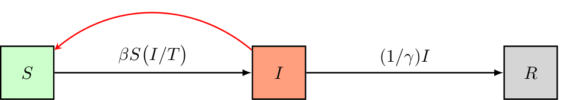

## Modeling and Calibration Workflow

In this tutorial, we'll use the simple SIR disease model without dimensions from the [quickstart](quickstart.md) tutorial and calibrate its basic reproduction number to a synthetically generated dataset. We'll then asses what happens if the pathogen's infectivity is lowered by means of preventive measures. This tutorial steps you through a typical workflow constituting the following steps,

1. Import dependencies
2. Load the dataset
3. Load/Define a model
4. Initialize the model
5. Calibrate the model (PSO/NM + MCMC)
6. Visualize the goodness-of-fit
7. Perform a scenario analysis

By using a simple model, we can focus on the general workflow and on the most important functions of pySODM, which will be similar in the more research-driven [enzyme kinetics](enzyme_kinetics.md) and [Influenza](influenza_1718.md) case studies available on this documentation website. This tutorial can be reproduced using `~/tutorials/SIR/workflow_tutorial.py`

### Import dependencies

I typically place all my dependencies together at the top of my script. However, for this demo, we'll import some common dependencies here and then import the pySODM code on the go. That way, the imports of the necessary pySODM code are located where they are required which is more illustrative than including them all here at once.

```
import numpy as np
import pandas as pd
from matplotlib.pyplot import plt
```

### Load the dataset

For the purpose of this tutorial, we'll generate a sythetic dataset of disease cases. We'll accomplish this by assuming the disease is generating cases exponentially with a doubling time of 10 days. Alternatively, the output of the SIR model could be used to generate a dataset of disease cases. Mathematically,

```{math}
n_{cases}(t) = \exp \Big( t *  \dfrac{\log 2}{t_d} \Big)
```

We'll assume the first case was detected on December 1st, 2022 and data was collected on every weekday until December 21st, 2022. Then, we'll add observational noise to the synthetic data. For count based data, observational noise is typically the result of a poisson or negative binomial proces, depending on the occurence of overdispersion. For a poisson proces, the variance in the data is equal to the mean: {math}`\sigma^2 = \mu`, while for a negative binomial proces the mean-variance relationship is quadratic: {math}`\sigma^2 = \mu + \alpha \mu^2`. For this example we'll use the negative binomial distribution with a dispersion factor of `alpha=0.03`, which was representative for the data used during the COVID-19 pandemic in Belgium. Note that for {math}`\alpha=0`, the variance of the negative binomial distribution is equal to the variance of the poisson distribution.

```
# Parameters
alpha = 0.03 # Overdispersion
t_d = 10 # Doubling time
# Sample data
dates = pd.date_range('2022-12-01','2023-01-21')
t = np.linspace(start=0, stop=len(dates)-1, num=len(dates))
y = np.random.negative_binomial(1/alpha, (1/alpha)/(np.exp(t*np.log(2)/td) + (1/alpha)))
# Place in a pd.Series
d = pd.Series(index=dates, data=y, name='CASES')
# Data collection only on weekdays only
d = d[d.index.dayofweek < 5]
```

Datasets used in an optimization must always be a `pd.Series`, in case the model has no dimensions, or a `pd.DataFrame` with a `pd.MultiIndex` if the model has dimensions. In the dataset, an index level named `time` (if the time axis consists of int/float) or `date` (if the time axis consists of dates) must always be present. In this tutorial, we'll use dates and thus we rename the index of our dataset `date`. 

```
# Index name must be data for calibration to work
d.index.name = 'date'
print(d)
```

```bash
date
2022-12-01     1
2022-12-02     1
...
2023-01-19    34
2023-01-20    24
Name: CASES, dtype: int64
```

Visually,


### Define and initialize the model

As an example, we'll set up a simple Susceptible-Infectious-Removed (SIR) disease model, schematically represented as follows,



and governed by the following equations,
```{math}
\begin{eqnarray}
N &=& S + I + R, \\
\frac{dS}{dt} &=& - \beta S (I/N), \\
\frac{dI}{dt} &=& \beta S (I/N) - (1/\gamma)I, \\
\frac{dR}{dt} &=& (1/\gamma)I.
\end{eqnarray}
```

The model has three states: 1) The number of individuals susceptible to the disease (S), 2) the number of infectious individuals (I), and 3) the number of removed individuals (R). The model has two parameters: 1) `beta`, the rate of transmission and, 2) `gamma`, the duration of infectiousness. Building a model is based on the class inheritance, the user must first load the `ODEModel` class from `~/src/models/base.by`. Then, the user must define his/her own class which must contain (minimally),
- A list containing the state names `state_names`,
- A list containing the parameter names `parameter_names`,
- An `integrate()` function where the differentials of the model are computed,

and take the `ODEModel` class as its input. Checkout the documentation of the ODEModel class [here](models.md). There are some important formatting requirements to the integrate function, which are verified when the model is initialized,
1. The integrate function must have the timestep `t` as its first input
2. The model states and parameters must also be given as input, their order does not make a difference
3. The integrate function must return a differential for every model state, arranged in the same order as the state names defined in `state_names`
4. The integrate function must be a static method (include `@staticmethod`)

```
# Import the ODEModel class
from pySODM.models.base import ODEModel

# Define the model equations
class ODE_SIR(ODEModel):
    """
    Simple SIR model without dimensions
    """
    
    state_names = ['S','I','R']
    parameter_names = ['beta','gamma']

    @staticmethod
    def integrate(t, S, I, R, beta, gamma):
        
        # Calculate total population
        N = S+I+R
        # Calculate differentials
        dS = -beta*S*I/N
        dI = beta*S*I/N - 1/gamma*I
        dR = 1/gamma*I

        return dS, dI, dR
```

After defining our model, we'll initialize it by supplying a dictionary of initial states and a dictionary of model parameters. In our example, we'll assume the disease spreads in a relatively small population of 1000 individuals. At the start of the simulation we'll assume there is one "patient zero". We don't have to define the number of recovered individuals as undefined states are automatically set to zero by pySODM.

```
model = ODE_SIR(states=init_states={'S': 1000, 'I': 1}, parameters={'beta': 0.35, 'gamma': 5})
```

### Calibrating the model

#### The posterior probability 

Before we can have our computer find a set of model parameters that aligns the model with the data, we must instruct it what deviations between the data and model prediction are tolerated. Such function is often referred to as an *objective function* or *likelihood function*. In all tutorials we will set up and attempt to maximize the *posterior probability* of our model's parameters in light of the data {math}`p(\theta | y_{\text{data}})`. It contrasts with the *likelihood function* {math}`p(y_{\text{data}} | \theta)`, which is the probability of the data given a fixed set of the model's parameter values. The two are related as follows by Bayes' theorem,

$$ p (\theta | y_{\text{data}}) = \frac{p(y_{\text{data}} | \theta) p(\theta)}{p(y_{\text{data}})}. $$

Here, {math}`p(y_{\text{data}})` is used for normalization and can be ignored for all practical purposes. {math}`p(\theta)` is referred to as the *prior probability* of the model parameters and contains any prior beliefs about the probability density distribution of the parameters {math}`\theta`. What is really important to remember is that the *posterior probability* {math}`p(\theta | y_{\text{data}})` is proportional to the product of the *likelihood* {math}`p(y_{\text{data}} | \theta)` and the parameter *prior probability* {math}`p(\theta)`. We'll maximize the logarithm of the *posterior probability*, computed as the sum of the logarithm of the *prior probability* and the logarithm of the *likelihood*. For an introduction to Bayesian inference, I recommend reading the following [article](https://towardsdatascience.com/a-gentle-introduction-to-bayesian-inference-6a7552e313cb). I also recommend going through the following tutorial of [emcee](https://emcee.readthedocs.io/en/stable/tutorials/line/).

Remember: LOG POSTERIOR = LOG PRIOR + LOG LIKELIHOOD

#### Choosing an appropriate prior function

For every calibrated model parameter we will need to provide a probability function expressing our prior believes with regard to the probability distribution of that parameter. pySODM includes uniform, normal, triangular, gamma and weibull priors, which can be imported as follows (reside in `~/src/pySODM/optimization/objective_functions.py`),

```
from pySODM.optimization.objective_functions import log_prior_uniform, log_prior_normal, log_prior_triangle, log_prior_gamma, log_prior_weibull, log_prior_custom
```

For most problems, uniform prior probabilities, which simply constraint the parameter values within certain bounds, suffice. When initializing the [`log_posterior probability` class](optimization.md) it is not necessary to define priors for your parameters. If no priors are defined, by default, pySODM will initialize uniform priors for the calibrated parameters.

#### Choosing an appropriate likelihood function

The next step is to choose an appropriate log likelihood function {math}` \log [ p(y_{\text{data}} | \theta) ]`. The log likelihood function is a function that describes the magnitude of the error when model prediction and data deviate. The bread and butter log likelihood function is the sum of squared errors (SSE),
```{math}
SSE = \sum_i (y_{data,i} - y_{model,i})^2,
```
this is actually a simplified case of the following Guassian log likelihood function,
```{math}
\log \big[ p(y_{data} | y_{model}, \sigma) \big] = - \frac{1}{2} \sum_i \Bigg[ \frac{(y_{data,i} - y_{model,i})^2}{\sigma_i^2} + \log (2 \pi \sigma_i^2) \Bigg].
```
from the above equations we can deduce that the SSEs's use is only appropriate when the error on all datapoints are the same (i.e. {math}`\sigma_i^2 = 1`). If the errors ({math}`\sigma_i`) of all datapoints ({math}`y_{data,i}`) are known, then the Gaussian log likelihood function is the most appropriate objective function. When the error of the datapoints are unknown, we must analyze the mean-variance relationship in our dataset to choose the appropriate likelihood function or make an assumption. For epidemiological case data, dispersion tends to grow with the magnitude of the data and only one datapoint is available per day (so no error is readily available). In that case, pySODM's [`variance_analysis()` function](optimization.md) includes the necessary tools to approximate the mean-variance relationship in a dataset of counts. By dividing the dataset in discrete windows and comparing an exponential moving average to the data, mean-variance couples can be approximated. Then, the appropriate likelihood function can be found by fitting the following candidate models,

| Mean-Variance model          | Relationship                               |
|------------------------------|--------------------------------------------|
| Gaussian                     | {math}`\sigma^2 = c`                       |
| Poisson                      | {math}`\sigma^2 = \mu`                     |
| Quasi-Poison                 | {math}`\sigma^2 = \alpha * \mu`            |
| Negative Binomial            | {math}`\sigma^2 = \mu + \alpha * \mu^2`    |

The following snippet performs the above procedure on our synthetic dataset. 
```
from pySODM.optimization.utils import variance_analysis

results, ax = variance_analysis(d, resample_frequency='W')
alpha = results.loc['negative binomial', 'theta']
print(results)
plt.show()
plt.close()
```

```bash
                       theta        AIC
gaussian           14.568640  52.300657
poisson             0.000000  44.165044
quasi-poisson       1.925682  38.796586
negative binomial   0.042804  32.045864
```
The negative binomial model with dispersion coefficient {math}`\alpha = 0.043` is the most appropriate statistical model (lowest AIC). This estimate is quite good considering we're using a very limited amount of data generated from a negative binomial model with a dispersion coefficient {math}`\alpha = 0.03`.


#### Setting up the posterior probability in pySODM

Let's initialize an appropriate [posterior probability function](optimization.md) for the problem at hand. We start by importing the `log_posterior_probability` class and the negative binomial likelihood function `ll_negative_binomial`. The following arguments of `log_posterior_probability` are mandatory,
1. `model`: The previously initialized model.
2. `pars`: A list containing the names of the model parameters we wish to optimize. pySODM can be used to calibrate 0D, 1D and nD model parameters.
3. `bounds`: A list containing the lower and an upper bounds of the parameters.
4. `data`: A list containing the datasets we wish to calibrate our model to.
5. `states`: A list containing, for every dataset, the model state that must be matched with it.
6. `log_likelihood_function`: A list containing, for every dataset, the log likelihood function used to describe deviations between the model prediction and the respective dataset.
7. `log_likelihood_function_args`: A list containing the arguments of every log likelihood function.

The lengths of the number of `data`, `states`, `log_likelihood function` and `log_likelihood_function_args` must always be equal. In the example, as no prior functions are provided, the priors will default to uniform priors over the provided bounds. Providing a label is also optional, if no label is provided, the names provided in `pars` are used as labels.

```
if __name__ == '__main__':
    
    # Import the log_posterior_probability class
    from pySODM.optimization.objective_functions import log_posterior_probability

    # Import the negative binomial likelihood function
    from pySODM.optimization.objective_functions import ll_negative_binomial

    # The datasets, the model states to match to the datasets,
    # the log likelihood functions and log likelihood function arguments
    data=[d, ]
    states = ["I",]
    log_likelihood_fnc = [ll_negative_binomial,]
    log_likelihood_fnc_args = [alpha,]

    # Calibated parameters, their bounds and preferred labels
    pars = ['beta',]
    bounds = [(1e-6,1),]
    labels = ['$\\beta$',]
    
    # Setup objective function (no priors --> uniform priors based on bounds)
    objective_function = log_posterior_probability(model, pars, bounds, data, states, 
                                                   log_likelihood_fnc, log_likelihood_fnc_args,
                                                   labels=labels)
```

#### Nelder-Mead optimization

The following code snippet starts a Nelder-Mead optimization from the initial guess {math}`\beta = 0.35`, perturbated with a `step` of 10%. Running on `processes=1` cores for `max_iter=10` iterations.

```
if __name__ == '__main__':
    # Import the Nelder-Mead algorithm
    from pySODM.optimization import nelder_mead
    # Initial guess
    theta = [0.35,]
    # Run Nelder-Mead optimisation
    theta = nelder_mead.optimize(objective_function, theta, step=[0.10,], processes=1, max_iter=10)[0]
```
We find an optimal value of {math}`\beta \pm 0.27`. We can then asses the goodness-of-fit by updating the dictionary of model parameters with the newly found value for `beta`, simulating the model and visualizing the model prediction and dataset.

```
if __name__ == '__main__':
    # Update beta with the calibrated value
    model.parameters.update({'beta': theta[0]})
    # Simulate the model
    out = model.sim([start_date, end_date])
    # Visualize result
    fig,ax=plt.subplots()
    ax.plot(out['date'], out['I'], color='red', label='Infectious')
    ax.scatter(d.index, d.values, color='black', alpha=0.6, linestyle='None', facecolors='none', s=60, linewidth=2, label='data')
    ax.legend()
    plt.show()
    plt.close()
```

Quite nice!


#### Bayesian inference

This approach moves away from the idea of accepting a single parameter value being the best fit to the data, and instead identifies all regions of the parameter space that are in agreement with the observations. In the language of Bayesian inference, what we seek is called the posterior distribution of the parameters: a probability distribution on the parameter space that assigns higher probability to areas that are in better agreement with the observations. Here, we demonstrate that a Bayesian approach provides accurate estimates of model parameters and their uncertainty.

We'll use our previous estimate to initiate our Markov-Chain Monte-Carlo sampler. This requires the help of two functions: [perturbate_theta()](optimization.md) and [run_EnsembleSampler()](optimization.md). We'll initiate 9 chains per calibrated parameter, so there will be 9 chains in total. To do so, we'll first use `perturbate_theta` to perturbate our previously obtained estimate `theta` by 10%. The result is a np.ndarray `pos` of shape `(1, 9)`, which we'll then pass on to `run_EnsembleSampler()`.

Then, we'll setup and run the sampler using `run_EnsembleSampler()` until the chains converge. We'll run the sampler for `n_mcmc=100` iterations and print the diagnostic autocorrelation and trace plots every `print_n=10` iterations in a folder called `sampler_output/`. For convenience, a copy of the samples is saved there as well. As an identifier for our *experiment*, we'll use `'username'`. While the sampler is running, have a look in the `sampler_output/` folder, which should look as follows,

```
├── sampler_output 
|   |── username_BACKEND_2022-12-16.hdf5
│   ├── autocorrelation
│       └── username_AUTOCORR_2022-12-16.pdf
│   └── traceplots
│       └── username_TRACE_2022-12-16.pdf
```

The output of the above procedure yields an `emcee.EnsembleSampler` object containing our 100 iterations for 9 chains. We can extract the chains quite by using the `get_chain()` method (see the [emcee documentation](https://emcee.readthedocs.io/en/stable/user/sampler/)). However, we're interested in building a dictionary of samples because this interfaces nicely to pySODM's *draw functions* (introduced below). Using `emcee_sampler_to_dictionary()`, the generated chains and the entries provided in `settings` are formatted into a dictionary `samples_dict`, which is automatically saved in a json format. Finally, we'll use the third-party `corner` package to visualize the distributions of the five calibrated parameters.

```
if __name__ == '__main__':

    from pySODM.optimization.mcmc import perturbate_theta, run_EnsembleSampler, emcee_sampler_to_dictionary

    # Settings
    n_mcmc = 100
    multiplier_mcmc = 9
    processes = 9
    print_n = 10
    discard = 20
    samples_path = 'sampler_output/'
    fig_path = 'sampler_output/'
    identifier = 'username'
    # Perturbate previously obtained estimate
    ndim, nwalkers, pos = perturbate_theta(theta, pert=[0.10,], multiplier=multiplier_mcmc, bounds=bounds)
    # Usefull settings to retain in the samples dictionary (no pd.Timestamps or np.arrays allowed!)
    settings={'start_calibration': start_date.strftime("%Y-%m-%d"), 'end_calibration': end_date.strftime("%Y-%m-%d"),
              'n_chains': nwalkers, 'starting_estimate': list(theta)}
    # Run the sampler
    sampler = run_EnsembleSampler(pos, n_mcmc, identifier, objective_function,
                                  fig_path=fig_path, samples_path=samples_path, print_n=print_n,
                                  processes=processes, progress=True, settings_dict=settings)
    # Generate a sample dictionary and save it as .json for long-term storage
    samples_dict = emcee_sampler_to_dictionary(samples_path, identifier, discard=discard)

    print(samples_dict)
```

The resulting dictionary of samples contains the samples of `beta`, as well as the variables defined in the `settings` dictionary.
```bash
{'beta': [0.2758539499364022, ...,  0.27321610939267427, 0.27459471960360476], 'start_calibration': '2022-12-01', 'end_calibration': '2023-01-20', 'n_chains': 9, 'starting_estimate': [0.2745855197310446]}
```

### Results

#### Basic reproduction number

For our simple SIR model, the basic reproduction number is defined as,
```{math}
R_0 = \frac{\beta}{(1/\gamma)}.
```
Using the obtained samples, we find a basic reproduction number of {math}`R_0 = 1.37 \pm 0.01`. Its distribution looks as follows,
```
# Visualize the distribution of the basic reproduction number
fig,ax=plt.subplots()
ax.hist(np.array(samples_dict['beta'])*model.parameters['gamma'], density=True, color='black', alpha=0.6)
ax.set_xlabel('$R_0$')
plt.show()
plt.close()
```


#### Goodness-of-fit: draw functions

Next, let's visualize how well our simple SIR model fits the data. To this end, we'll simulate the model a number of times, and at each time we'll update the value of `beta` with a sample drawn by the MCMC. Then, assuming our model is an adequate representation of the modeled proces, we'll add observational noise to each model trajectory using `add_negative_binomial()`. Finally, we'll visualize the individual model trajectories and the data to asses the goodness-of-fit.

To repeatedly simulate a model and update a parameter value in each consecutive run, we'll use what is called a *draw function*. This function always takes two input arguments, the model parameters dictionary `param_dict` and a dictionary containing samples `samples_dict`, and must always return the model parameters dictionary `param_dict`. The draw function defines how the samples dictionary can be used to update the model parameters dictionary. In our case, we'll use `np.random.choice()` to sample a random value of `beta` from the dictionary of samples and assign it to the model parameteres dictionary, as follows,
```
# Define draw function
def draw_fcn(param_dict, samples_dict):
    param_dict['beta'] = np.random.choice(np.array(samples_dict['beta']))
    return param_dict
```

Then, we'll provide four additional arguments to `sim()`,
1. `N`: the number of repeated simulations,
2. `samples`: the dictionary containing the samples of `beta` generated with the MCMC,
3. `draw_fcn`: our defined draw function,
4. `processes`: the number of cores to divide the `N` simulations over.

As demonstrated in the quickstart example, the `xarray` containing the model output will now contain an additional dimension to accomodate the repeated simulations: `draws`.

```
# Simulate model
out = model.sim([start_date, end_date+pd.Timedelta(days=28)], N=50, samples=samples_dict, draw_fcn=draw_fcn, processes=processes)
# Add negative binomial observation noise
out = add_negative_binomial_noise(out, dispersion)
# Visualize result
fig,ax=plt.subplots(figsize=(12,4))
for i in range(30):
    ax.plot(out['date'], out['I'].isel(draws=i), color='red', alpha=0.05)
ax.plot(out['date'], out['I'].mean(dim='draws'), color='red', alpha=0.6)
ax.scatter(d.index, d.values, color='black', alpha=0.6, linestyle='None', facecolors='none', s=60, linewidth=2)
ax.xaxis.set_major_locator(plt.MaxNLocator(3))
plt.show()
plt.close()
```

Our simple SIR model seems to fit the data very well. From the projection we can deduce that the peak number of infectees will fall around February 7th, 2023 and there will be between 30-50 infectees.


#### Scenarios: time-dependent model parameters

Finally, let us introduce the concept of varying model parameters over the course of the simulation. We would like to model what would happen if we could somehow reduce the infectivity of the disease by 50% starting January 21st. In the real world this could be accomplished by raising awareness to the disease and applying preventive measures.

We'll first need to implement a function to let our model know how a given parameter should vary over time: a *time-dependent model parameter function* (TDPF). Then, we'll need to re-initialize our model and tell it what model parameter should be varied in accordance to our function. For our problem, a TDPF would have the following syntax,

```
# Define a time-dependent parameter function
def lower_infectivity(t, states, param, start_measures):
    if t < start_measures:
        return param
    else:
        return 0.50*param
```

This simple function reduces the parameter `param` with a factor two if the simulation date is larger than `start_measures`. A time-dependent model parameter function must always have the arguments `t` (simulation timestep), `states` (dictionary of model states) and `param` (value of the parameter the function is applied to) as inputs. In addition, the user can supply additional arguments to the function, which need to be added to the dictionary of model parameters.

We will apply this function to the infectivity parameter `beta` by using the `time_dependent_parameters` argument of `sim()`.
```
# Attach the additional arguments of the time-depenent function to the parameter dictionary
params.update({'start_measures': '2023-01-21'})

# Initialize the model with the time dependent parameter funtion
model_with = ODE_SIR(states=init_states, parameters=params,
                     time_dependent_parameters={'beta': lower_infectivity})
```

Next, we compare the simulations with and without the use of our time-dependent model parameter function.

```
# Simulate the model
out_with = model_with.sim([start_date, end_date+pd.Timedelta(days=2*28)], N=50, samples=samples_dict, draw_fcn=draw_fcn, processes=processes)

# Add negative binomial observation noise
out_with = add_negative_binomial_noise(out_with, alpha)

# Visualize result
fig,ax=plt.subplots(figsize=(12,4))
for i in range(50):
    ax.plot(out['date'], out['I'].isel(draws=i), color='red', alpha=0.05)
    ax.plot(out_with['date'], out_with['I'].isel(draws=i), color='blue', alpha=0.05)
ax.plot(out['date'], out['I'].mean(dim='draws'), color='red', alpha=0.6)
ax.plot(out_with['date'], out_with['I'].mean(dim='draws'), color='blue', alpha=0.6)
ax.scatter(d.index, d.values, color='black', alpha=0.6, linestyle='None', facecolors='none', s=60, linewidth=2)
ax.xaxis.set_major_locator(plt.MaxNLocator(3))
ax.set_ylabel('Number of infected')
plt.show()
plt.close()
```

As we could reasonably expect, if we could implement some form of preventive measures on January 21st that slashes the infectivity in half, cases quite abruptly start declining and thus less people contrapt the disease.


However, it is unlikely that people would adopt these preventive measures instantly. Adoptation of measures is more gradual in the real world. We could tackle this problem in two ways using pySODM,
- Implementing a ramp function to lower the infectivity in our time-dependent model parameter function,
- Using *draw functions* to sample `start_measures` stochastically in every simulation. We'll demonstrate this option.

To simulate ramp-like adoptation of measures, we can add the number of additional days it takes beyond January 21st, 2023 to adopt the measures by sampling from a triangular distribution with a minimum and mode of zero days, and a maximum adoptation time of 21 days. All we have to do is add one line to the draw function,

```
# Define draw function
def draw_fcn(param_dict, samples_dict):
    param_dict['beta'] = np.random.choice(samples_dict['beta'])
    param_dict['start_measures'] += pd.Timedelta(days=np.random.triangular(left=0,mode=0,right=21))
    return param_dict
```

Gradually adopting the preventive measures results in a more realistic simulation,


### Conclusion

I hope this tutorial has demonstrated the workflow pySODM can speedup. However, both our model and dataset had no labeled dimensions so this example was very rudimentary. pySODM allows to tackle much more convoluted problems across different fields. However, the basic syntax of our workflow remains practically unchanged. I illustrate this with the following tutorials,

| Case study                                     | Features                                                                                          |
|------------------------------------------------|---------------------------------------------------------------------------------------------------|
| Enzyme kinetics: intrinsic kinetics            | Dimensionless ODE model. Calibration to multiple datasets with changing initial conditions.       |
| Enzyme kinetics: 1D Plug-Flow Reactor          | Use the method of lines to discretise a PDE model into an ODE model with one dimension.           |
| Influenza 2017-2018                            | SDE model with one dimension. Calibration of a 1D model parameters on a 1D dataset.               |
| SIR-SI Model (see `~/tutorials/SIR_SI/`)       | ODE model where states have different dimensions and thus different shapes.                       |